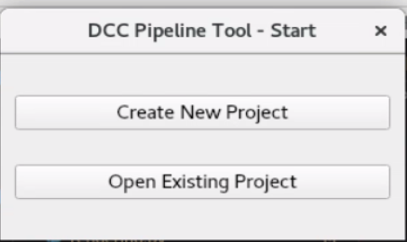

# Rendering Pipeline Tool

A standalone pipeline tool that streamlines asset and scene transfers between Maya and Houdini with basic shots management features. It allows for project creation, scene management, rendering, and visualization within a PySide2-based GUI

## Features
- Scene export/import between Maya and Houdini 
- Asset versioning and tracking
- Shots and asset management
- Shared project folder structure

## DCC Tools Supported
- Autodesk Maya (2023+)
- SideFX Houdini (20.0+)
- Autodesk Arnold Renderer
- SideFX Karma Renderer

## Technology Stack:
- Python 3.10+
- PySide2 for GUI
- PyYaml for data Management
- pytest for Unit Testing

## Setup
Requires Python 3.10+
 
 ``` 
 git clone https://github.com/Radekeo/DCC-Pipeline_Tool.git
 ```

```
cd DCC-Pipeline_Tool`
```


## Usage
Run `main.py` or launch the GUI via `main.py`

```
uv run main.py`
```

to see this window



Create a new project using a scene file; the program accepts .ma,.mb,.usd,.usda,.usdc files. You can use the [sample file](sample/scene.mb)


# [Project Architecture](architecture.md)